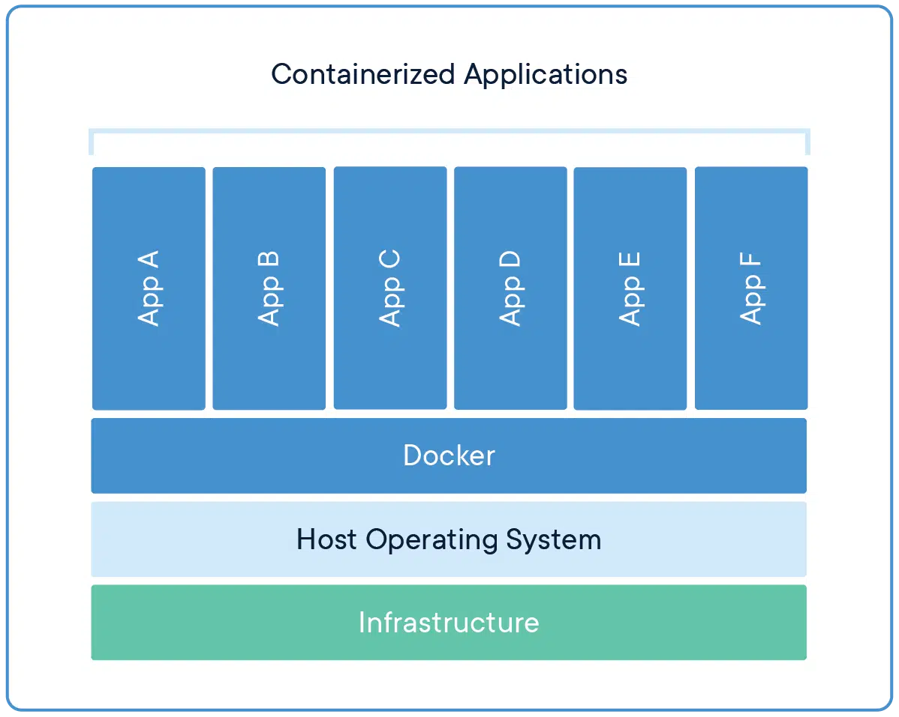

!!! info "进阶内容"
    此部分涉及较为底层的原理，需要一定的操作系统知识，可以略过。建议根据实际掌握的知识水平选择性浏览。

传统的虚拟机和 Docker 的区别如下图所示：

<div>
  
  
</div>

Docker 容器与宿主机共享操作系统内核，直接运行在宿主操作系统上；而虚拟机通过 Hypervisor 与宿主机共享虚拟化后的硬件资源，运行的是完整的操作系统。

换句话说，Docker 容器实际上就是一些**直接**运行在宿主机上的程序，只不过它们和其他程序是隔离的。这种隔离有几个方面：

**进程隔离。**Docker 容器内部拥有独立的进程命名空间，无法看到宿主机上的进程，也无法看到其他容器中的进程。通过进程隔离，Docker 保证了容器一定的安全性。

!!! note "容器内部的进程是宿主机上的普通进程"
    与虚拟机不同，容器共享宿主机操作系统内核，因此容器内部的进程实际上是宿主机系统上的普通进程，只不过容器内部只能看到这些进程而已。

    可以做一个小实验来验证这一点。我们运行一个 `ubuntu` 容器，并在后台持续运行 `cat`：

    ```bash
    docker run --name test --rm -itd ubuntu cat
    ```

    然后，分别查看宿主机上和容器中的进程：

    ```bash
    ps aux | grep cat
    # root        5549  0.0  0.0   2344   764 pts/0    Ss+  17:33   0:00 cat
    ```

    ```bash
    docker exec test ps aux
    # USER         PID %CPU %MEM    VSZ   RSS TTY      STAT START   TIME COMMAND
    # root           1  0.0  0.0   2344   764 pts/0    Ss+  09:33   0:00 cat
    # root           6  0.0  0.0   6420  1596 ?        Rs   09:34   0:00 ps aux
    ```

    可以看到，`cat` 在容器内部是进程号为 1 的进程，而这个进程在宿主机上也可见，不过进程号与容器内部不同。

    顺便提一下，容器运行时只有 `cat` 一个进程（`ps` 进程为打印进程时产生的进程），没有任何其他的进程，这也是 Docker 所谓“轻量级”的表现。

**网络隔离。**（一般情况下）容器内部具有独立的网络命名空间，容器之间可以通过使用 Docker 创建的网络互相连接。

**文件系统隔离。**Docker 容器具有自己的 root 文件系统，因此可以实现依赖库等文件与宿主机的完全隔离，易于配置、分发环境。通过挂载数据卷或宿主机目录，Docker 容器可以更加灵活地与外界交互。

**物理资源隔离。**Docker 可限制容器可访问的物理资源，如内存、CPU 等（虽然本课程并未涉及）。

这几种隔离的实现依赖于 Linux 系统提供的 Namespace、CGroup 等技术，因此目前只有 Linux 系统原生支持 Docker，个人版 Windows 系统 和 macOS 系统上的 Docker 是通过在 Linux 虚拟机上运行实现的。这些技术的细节已远远超出本课程的范围。掌握 Docker 的使用方法，并理解其高效性背后的原理，对于高效地使用 Docker 已经足够了。
